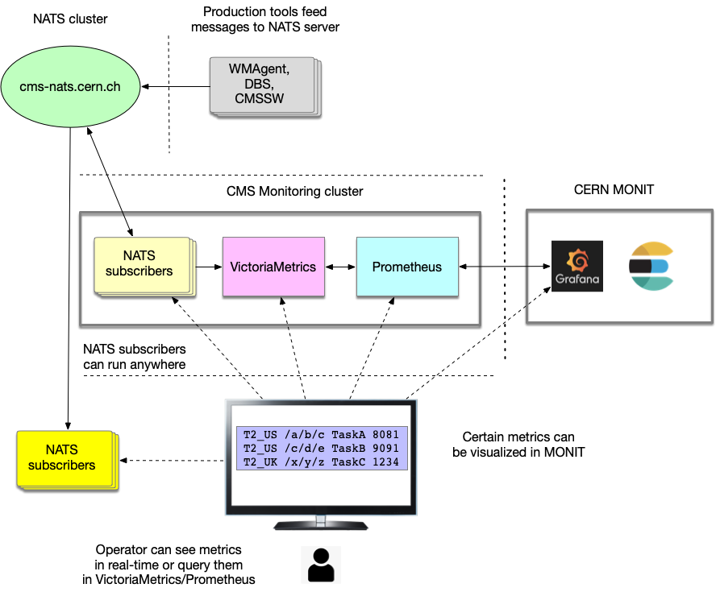

### CMS Monitoring cluster architecture
Here we present CMS Monitoring cluster architecture


### CMS Promeetheus service
The [Prometheus](https://prometheus.io/) is  an open-source systems monitoring.

### CMS Prometheus deployment to k8s
We rely on [Prometheus-Opeartor](https://github.com/coreos/prometheus-operator)
CRD which can be used to easily deploy prometheus service on k8s
infrastructure.

The deployment of CMS Monitoring k8s cluster is trivial. Please follow
these steps:
```
# login to lxplus-cloud
ssh lxplus-cloud

# clone CMSKubernetes repository
git clone git@github.com:dmwm/CMSKubernetes.git
cd CMSKubernetes/monitoring

# clone CMS Monitoring secrets repository
git clone https://:@gitlab.cern.ch:8443/cms-monitoring/secrets.git

# create a new cluster
./deploy.sh create cluster

# deploy cluster services
deploy.sh create services

# check cluster services
./deploy.sh status

# clean-up (destroy) services
./deploy.sh cleanup
```

That's it!

Quite often we need to restart prometheus with new configuration. To do that
please following these steps:
```
# change prometheus configuration/secrets
vim secrets/prometheus/prometheus.yaml

# create new secrets
./deploy.sh create secrets

# restart prometheus pod, replace prometheus-XXX with actual prometheus pod name
kubectl delete pod/<prometheus-XXX>
```

### Structure
This area contains several sub-directories. Here we describe overall structure:
- **services** area contains CMS specific services, like nats subscribers,
  prometheus, VM services
- **crd** represents CRD areas of specific deployments, e.g. Prometheus server
- **ingress** contains ingress controllers definitions
- **kmon** provides files for k8s monitoring tools like kube-eagle
- **storages** contains files for persistent storages, like cinder, CephFS

#### Prometheus-operator deployment
We provide files `bundle.yaml` and `prom-oper.yaml` in `crd/prometheus` area to deploy
prometheus cluster via
[Prometheus-operator](https://github.com/coreos/prometheus-operator)
deployment procedure. But we found certain limitation, in prometheus
configuration, which does not allow to integrate this
deployment with VictoriaMetrics service. Therefore, so far we do not
use CRD deployment.

#### Prometheus custom deployment
The custom Prometheus deployment is based on `prometheus.yaml` manifest
file. It uses promtheus image and allows to provide custom configuration
of the service, e.g. add VictoriaMetrics service, use `file_sd_configs`
configuration, etc.

### Pushgateway service
The [Prometheus-pushgateway](https://github.com/prometheus/pushgateway)
service exists to allow ephemeral and batch jobs to expose their metrics to
Prometheus. Its deployment is done via `deploy.sh` script or can be
done manually as following
```
kubectl apply -f pushgateway.yaml
```
The service is open on port 30091 and
NATS subscriber can send any metrics to this service via simple
HTTP call, e.g.
```
echo "some_metric 3.14" | curl --data-binary @- http://cms-monitoring.cern.ch:30091/metrics/job/some_job
```

### VictoriaManifest backend
We also deploy [VictoriaMetrics](https://victoriametrics.com/) service
which can be used as Prometheus backend and long-term storage, as well
as a storage for NATS monitoring messages. It supports Prometheus
[PromQL](https://prometheus.io/docs/prometheus/latest/querying/basics/),
[Prometheus Query API](https://prometheus.io/docs/prometheus/latest/querying/api/),
and additional
[extensions](https://github.com/VictoriaMetrics/VictoriaMetrics/wiki/ExtendedPromQL)
which we can use for monitoring purposes. The VictoriaMetrics
provides high-performance, scalability, queyring, high data-compression,
and efficient storage, for all details please refer
to VictoriaMetrics [documentation](https://victoriametrics.github.io/#pure-go-build-cgo_enabled0)
and VictoriaMetrics
[benchmark](https://medium.com/@valyala/high-cardinality-tsdb-benchmarks-victoriametrics-vs-timescaledb-vs-influxdb-13e6ee64dd6b)
pages.

The deployment is done internally by `deploy.sh` or can be done
as simple as following:
```
kubectl apply -f victoria-metrics.yaml
```
The service operates on two ports, 30422 to insert data and
30428 to retrieve the data. The injected data should follow
[OpenTSDB](http://opentsdb.net/docs/build/html/user_guide/writing/index.html)
format, and we can insert and query data as following:
```
url="http://cms-monitoring.cern.ch"
purl=${url}:30422/api/put
rurl=${url}:30428/api/v1/export
qurl=${url}:30428/api/v1/query

# insert data into VictoriaMetrics
echo "put data into $purl"
curl -H 'Content-Type: application/json' -d '{"metric":"cms.dbs.exitCode", "value":8021, "tags":{"site":"T2_US", "task":"test", "log":"/path/file.log"}}' "$purl"

# fetch timeseries data from VictoriaMetrics
echo "get data from $rurl"
curl -G "$rurl" -d 'match[]=cms.dbs.exitCode'

# query data from VictoriaMetrics using PromQL, e.g. find rate of exitCode=8021 in last 5min
echo "get data from $rurl"
curl -G "$rurl" -d 'query=rate({exitCode="8021"})[5m]'

# the output of query
put data into http://cms-monitoring.cern.ch:30422/api/put
get data from http://cms-monitoring.cern.ch:30428/api/v1/export
{"metric":{"__name__":"cms.dbs.exitCode","log":"/path/file.log","site":"T2_US","task":"test"},"values":[8021,8021],"timestamps":[1575635036000,1575635041000]}
```
For more information about VictoriaMetrics please see
its [FAQ](https://github.com/VictoriaMetrics/VictoriaMetrics/blob/master/docs/FAQ.md)
and its
[Single-node](https://github.com/VictoriaMetrics/VictoriaMetrics/blob/master/docs/Single-server-VictoriaMetrics.md#how-to-export-time-series)
tutorial and blog about
[Prometheus Subqueries in
VictoriaMetrics](https://medium.com/@valyala/prometheus-subqueries-in-victoriametrics-9b1492b720b3)

### NATS subscribers
We also deploy to our cluster NATS subscribers daemons.
Their task is handle various NATS subscriptions on different topics.
So far we monitor the following topics:
- WMArchive exitCodes and their stats
- WMArchive T1, T2 sites

We plan to add:
- DBS dataset monitoring
- WMAgent job status monitoring

### Content
Here we provide content of repository
```
# aux files
deploy.sh              # script to deploy all services

# prometheus operator files
bundle.yaml            # create CRD bundle
prom-oper.yaml         # deployment manifest file

# service files
prometheus.yaml        # prometheus deployment manifest
pushgateway.yaml       # pushgateway deployment manifest
victoria-metrics.yaml  # VictoriaMetrics manifest
nats-sub-exitcode.yaml # NATS subscriber for cms.wmarchive.exitCode topic
nats-sub-stats.yaml    # NATS subscriber for cms.wmarchive.exitCode stats
nats-sub-t1.yaml       # NATS subscriber for cms.wmarchive.site.T2 topic
nats-sub-t2.yaml       # NATS subscriber for cms.wmarchive.site.T2 topic
nats-sub.yaml          # NATS subscriber (original manifest)
```

### AlertManager
[AlertManager](https://prometheus.io/docs/alerting/alertmanager/) handles
alerts which can be send by Prometheus server. Its
[configuration](https://prometheus.io/docs/alerting/configuration/#email_config)
is straighforward, e.g. see this
[example](https://github.com/prometheus/alertmanager/blob/master/doc/examples/simple.yml).
Here we only provide useful tips:

##### slack support for AlertManager
To add support for Slack notification we need
- create new slack group
- create new channel within your slack group
- create an [incoming webhook](https://cmsmonitoringgroup.slack.com/apps/A0F7XDUAZ-incoming-webhooks?next_id=0)
- configure alert manager to push messages to slack channel of your choice
```
...
  # The child route trees.
  routes:
  - match:
      severity: slack
    receiver: 'slack_receivers'
receivers:
...
- name: 'slack_receivers'
  slack_configs:
  - api_url: 'YOUR_SLACK_API_URL'
    channel: 'YOUR_SLACK_CHANNEL'
    send_resolved: true
```

##### AlertManager rules
The [alerting rules](https://prometheus.io/docs/prometheus/latest/configuration/alerting_rules/)
can be quite complex. Here is nice
[talk](https://www.youtube.com/watch?v=RlOA5KgBkz8) and
[slides](https://promcon.io/2019-munich/slides/improved-alerting-with-prometheus-and-alertmanager.pdf)
which explains in details the rules.

##### AlertManager commands
Here we present useful commands:
```
# show routes
amtool config routes --alertmanager.url=http://cms-monitoring:30093
amtool config routes --config.file=alertmanager.yaml

# test routes
amtool config routes --config.file=alertmanager.yaml test severity=log,slack-test

# check configuration
amtool check-config alertmanager.yaml
```
For testing alert rules please see [8].

### References
1. [Prometheus Metrics and Labels](https://blog.pvincent.io/2017/12/prometheus-blog-series-part-1-metrics-and-labels/)
2. [Prometheus Metrics Types](https://blog.pvincent.io/2017/12/prometheus-blog-series-part-2-metric-types/)
3. [Prometheus: Exposing metrics](https://blog.pvincent.io/2017/12/prometheus-blog-series-part-3-exposing-and-collecting-metrics/)
4. [Prometheus: instrumenting code](https://blog.pvincent.io/2017/12/prometheus-blog-series-part-4-instrumenting-code-in-go-and-java/)
5. [Prometheus: Alerting rules](https://blog.pvincent.io/2017/12/prometheus-blog-series-part-5-alerting-rules/)
6. [NATS](https://docs.nats.io/)
7. [Victoria Metrics](https://victoriametrics.github.io/)
8. [Testing AlertManager rules](https://www.prometheus.io/docs/prometheus/latest/configuration/unit_testing_rules/)
