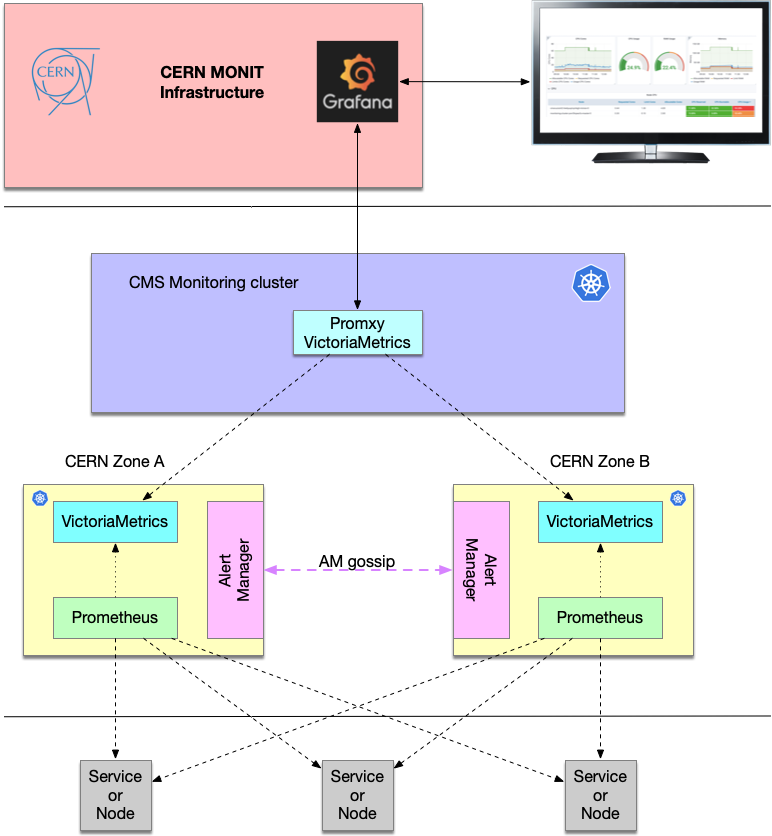

### CMS Monitoring HA documentation
This documentation provides all details for High-Availability (HA) mode 
of CMS monitoring infrastructure.



To achieve HA mode of operation we use the
following infrastructure setup:
- two kubernetes clusters (ultimately running in different CERN zones)
- [promxy](https://github.com/jacksontj/promxy) a prometheus proxy to unify
  access to Prometheus services
- each HA cluster (called `cms-monitoring-ha<N>`) contains the following stack
  of services:
  - [Prometheus](http://prometheus.io/) as a primary service to collect CMS
    metrics
  - [VictoriaMetrics](https://victoriametrics.github.io/) (VM) as backend service
  for Prometheus services
  - [AlertManager](https://www.prometheus.io/docs/alerting/latest/alertmanager/) (AM)
  as a service for Prometheus alerts
  - [httpgo](https://github.com/dmwm/CMSKubernetes/blob/master/kubernetes/monitoring/services/httpgo.yaml)
  a custom HTTP server to keep AlertManager messages
  - [kube-eagle](https://github.com/cloudworkz/kube-eagle) a prometheus
    exporter which exports various metrics of kubernetes pod resource requests,
    limits and it's actual usages.

The `promxy` provides an unified access to HA clusters and we configure it to
provide access to VM services. Then, the `promxy` service can be used in
Grafana to represent a data-source to our HA cluster.

We use the following port convention:
- 30090 points to 9090 port of Prometheus and exposed as NodePort on k8s
  infrastructure
- 30093 points to 9093 port of AM, it is default AM port
- 30094 points to 9094 port of AM, it is cluster's AM port for gossip protocol
- 30428 points to 8248 port of VM, it is VM HTTP port and it is used by
  Prometheus for `remote_write` section of its configuration to specify where
  to store its metrics (in our setup Prometheus metrics go to VM)
- 30242 points to 4242 port of VM, it is Open TSDB VM port
Please note, the 30XXX-32XXX port range is allowed by k8s to be used as
NodePorts and be accessible outside of k8s cluster. Therefore we use convension
30000+last three digit of service's port number.

### configuration
To properly configure HA mesh we need the following steps:
- configure promxy service on CMS Monitoring cluster
- configure Prometheus, VM and AM services on HA clusters

#### Configure promxy on CMS Monitoring cluster
The promxy service is quite straightforward. Its configuration file
resides in `secrets/promxy/config.yaml` and contains the following bits:

```
promxy:
  server_groups:
    # VM HA1 server
    - static_configs:
        - targets:
          - cms-monitoring-ha1:30428
      labels:
        sg: vm_ha1
      ignore_error: true
    # VM HA2 server
    - static_configs:
        - targets:
          - cms-monitoring-ha2:30428
      labels:
        sg: vm_ha2
```
Here we use two different server group labels `sg: vm_ha1` and `sg: vm_ha2`.
Also, we refer promxy which targets it should use (the service which will
provide the metrics). In our case it is two different VM services located in
our HA clusters.

#### Configuration of services on HA clusters
For HA clusters we should perform the following steps:
- setup proper environment on lxplus-cloud
```
# setup for HA1 cluster
export KUBECONFIG=/afs/cern.ch/user/v/valya/private/cmsweb/k8s_admin_config/config.monit/config.monitoring-vm-ha1
# setup for HA2 cluster
export KUBECONFIG=/afs/cern.ch/user/v/valya/private/cmsweb/k8s_admin_config/config.monit/config.monitoring-vm-ha2
```
- deploy VM in both clusters
```
kubectl apply -f services/ha/victoria-metrics.yaml
```
- deploy AM in both clusters with cluster peer mode (it is defined as an
  additional flag in AM yaml manifest)
```
# in HA1 cluster use alertmanager-ha1.yaml config
kubectl apply -f services/ha/alertmanager-ha1.yaml
# in HA2 cluster use alertmanager-ha2.yaml config
kubectl apply -f services/ha/alertmanager-ha2.yaml
```
- deploy Prometheus in both clusters with proper rules
```
# get list of prometheus rules create appropriate secret for HA1
files=`ls secrets/prometheus/*.json secrets/prometheus/*.rules secrets/prometheus/ha/ha1/prometheus.yaml | awk '{ORS=" "; print "--from-file="$1""}'`
# get list of prometheus rules create appropriate secret for HA2
files=`ls secrets/prometheus/*.json secrets/prometheus/*.rules secrets/prometheus/ha/ha2/prometheus.yaml | awk '{ORS=" "; print "--from-file="$1""}'`

# then recreate prometheus-secrets in each cluster
ns=default
secret=prometheus-secrets
kubectl -n $ns delete secret $secret
kubectl create secret generic $secret $files --dry-run=client -o yaml | kubectl apply --namespace=$ns -f -

# deploy prometheus service
kubectl apply -f services/ha/prometheus.yaml
```
- deploy `services/ha/kube-eagle.yaml` to monitor our HA cluster
- deploy `services/ha/httpgo.yaml` to consume logs from Prometheus

Finally, we deploy CMS specific services.

At the end each HA cluster will have the following set of services
in default namespace:
```
kubectl get pods
# example of HA1 cluster pods
NAME                                READY   STATUS    RESTARTS   AGE
alertmanager-8464c9bb5f-665nc       1/1     Running   0          17m
httpgo-688cc578-fghhc               1/1     Running   0          20d
kube-eagle-79c84f6b6d-94zvl         1/1     Running   0          20d
prometheus-54c6b9545d-gknls         1/1     Running   0          8m28s
victoria-metrics-6cbbb74bbb-494h5   1/1     Running   0          20d

# example of HA1 cluster services
kubectl get svc
NAME               TYPE        CLUSTER-IP       EXTERNAL-IP   PORT(S)                         AGE
alertmanager       NodePort    10.254.44.243    <none>        9093:30093/TCP,9094:30094/TCP   19m
httpgo             NodePort    10.254.184.66    <none>        8888:30888/TCP                  20d
kube-eagle         ClusterIP   10.254.115.233   <none>        8080/TCP                        20d
kubernetes         ClusterIP   10.254.0.1       <none>        443/TCP                         20d
prometheus         NodePort    10.254.185.99    <none>        9090:30090/TCP                  20d
victoria-metrics   NodePort    10.254.182.246   <none>        8428:30428/TCP,4242:30242/TCP   20d
```
and the following services in http namespace:
```
# list of pods in http namespace
kubectl get pods -n http
NAME                                     READY   STATUS    RESTARTS   AGE
es-exporter-wma-6ccd857477-ljkbl         1/1     Running   0          5s
http-exp-wmstatssrv-7dc9fdb954-kv4gw     1/1     Running   1          5d
http-exporter-6b75b458c-nkqs4            1/1     Running   1          5d
http-exporter-arucio-7f4f995766-6qgnj    1/1     Running   1          5d
http-exporter-cric-5d6846cfb9-wlgx6      1/1     Running   1          5d
http-exporter-detox-56d5df9dd6-p8kkf     1/1     Running   1          5d
http-exporter-dmytro-6fdd6475f7-fcv6c    1/1     Running   1          5d
http-exporter-mcm-84d56d8c94-8hfwk       1/1     Running   1          5d
http-exporter-mss-85f5dd7d87-flkbj       1/1     Running   1          5d
http-exporter-phedex-6b8d5895c9-h5w47    1/1     Running   1          5d
http-exporter-rucio-78dccc4b8b-f4qqw     1/1     Running   1          5d
http-exporter-unified-5c5574d7b8-h8tkp   1/1     Running   1          5d
http-exporter-wmstats-74ddf89645-5xpt6   1/1     Running   1          5d

# list of services in http namespace
ubectl get svc -n http
NAME                      TYPE        CLUSTER-IP       EXTERNAL-IP   PORT(S)     AGE
cert-checker              ClusterIP   10.254.192.249   <none>        8888/TCP    247d
es-exporter-wma           ClusterIP   10.254.42.167    <none>        18000/TCP   468d
hdfs-exporter-eos         ClusterIP   10.254.37.51     <none>        18000/TCP   107d
http-exp-wmstatssrv       ClusterIP   10.254.62.126    <none>        18009/TCP   472d
http-exporter             ClusterIP   10.254.48.85     <none>        18000/TCP   472d
http-exporter-arucio      ClusterIP   10.254.156.70    <none>        18012/TCP   472d
http-exporter-certcheck   ClusterIP   10.254.57.77     <none>        8888/TCP    230d
http-exporter-cric        ClusterIP   10.254.8.93      <none>        18004/TCP   472d
http-exporter-dmytro      ClusterIP   10.254.61.112    <none>        18010/TCP   472d
http-exporter-mcm         ClusterIP   10.254.70.72     <none>        18006/TCP   472d
http-exporter-mss         ClusterIP   10.254.168.67    <none>        18003/TCP   472d
http-exporter-rucio       ClusterIP   10.254.161.228   <none>        18011/TCP   472d
http-exporter-unified     ClusterIP   10.254.166.254   <none>        18005/TCP   472d
http-exporter-wmstats     ClusterIP   10.254.232.85    <none>        18008/TCP   472d
json-exporter-dbs-db      ClusterIP   10.254.117.139   <none>        17979/TCP   370d

# list of all crons
kubectl get cronjobs -A
NAMESPACE   NAME            SCHEDULE      SUSPEND   ACTIVE   LAST SCHEDULE   AGE
auth        cron-proxy      0 0 * * *     False     0        10h             267d
cpueff      cpueff-spark    00 06 * * *   False     0        4h15m           75d
default     cron-proxy      0 0 * * *     False     0        10h             234d
http        cron-kerberos   45 1 * * *    False     0        8h              472d
http        cron-proxy      0 0 * * *     False     0        10h             267d
```

### Availability zones
[CERN Availability Zone](https://clouddocs.web.cern.ch/containers/tutorials/nodegroups.html#availability-zone)
provides nodes allocation in three different CERN zones, zone-a, zone-b and zone-c.
By default cluster is created randomly in specific zone since
openstack will pick a zone oportunistically.
The following rules applies:

1. when a cluster created without Availability Zone (AZ),
openstack will pick a zone oportunistically. Could be any zone.

2. when you create a cluster with `--labels availability_zone=foo`,
all nodes of default master and default worker will be in foo

3. when you create a NG (nodegroups) with AZ (eg zone-a), 
all NG nodes will be in the specific az, new NG nodes too.

4. combine 1 and 3. cluster resize will create a node in any AZ.
NG resize will create node to the specified zone, (eg zoneA)

5. when creating a NG without an AZ, same as 1.

Here is examples of few commands operator can use either to find
AZ of k8s nodes, or create nodegroup (NG) for k8s nodes in specific zone:

```
# find AZ for a given VM
openstack server show "<vm name or id>"

# tfind AZ for a given k8s node
kubectl describe node

# for example
kubectl describe node monitoring-vm-ha1-3k4ljllzgy5x-node-0 | grep zone
                    failure-domain.beta.kubernetes.io/zone=cern-geneva-c
                    topology.cinder.csi.openstack.org/zone=cern-geneva-c
                    topology.kubernetes.io/zone=cern-geneva-c
# the first entry comes from master, while another from minion nodes

# create a node group in specific zone, here we put ha1 cluster
# in zone-a and ha2 cluster in zone-b
openstack coe nodegroup create monitoring-vm-ha1 zone-a --labels availability_zone=cern-geneva-a
openstack coe nodegroup create monitoring-vm-ha2 zone-b --labels availability_zone=cern-geneva-b
```

### Targets
Sometimes we need to compare Prometheus targets in different clusters.
Here we present an easy way to do that:
```
# first we extract targets from our monitoring cluster
# and pass it to jq tool (https://stedolan.github.io/jq/manual/)
# We'll apply jq query to extract __address__ of the target
curl http://cms-monitoring.cern.ch:30900/api/v1/targets | \
jq '.data.activeTargets | .[] | .discoveredLabels.__address__' | \
sort | uniq > mon.targets

# then we do the same for another cluster, e.g. ha2
curl http://cms-monitoring-ha2.cern.ch:30090/api/v1/targets | \
jq '.data.activeTargets | .[] | .discoveredLabels.__address__' | \
sort | uniq > ha2.targets

# finally we can simply do a diff among the two
diff mon.targets ha2.targets
```

### Alerts
```
# get alerts from mon cluster
curl http://cms-monitoring.cern.ch:30093/api/v1/alerts | jq '.data| .[] | .labels.alertname' | sort | uniq > mon.alerts
# get alerts from ha1/ha2 clusters
curl http://cms-monitoring-ha1.cern.ch:30093/api/v1/alerts | jq '.data| .[] | .labels.alertname' | sort | uniq > ha1.alerts
curl http://cms-monitoring-ha2.cern.ch:30093/api/v1/alerts | jq '.data| .[] | .labels.alertname' | sort | uniq > ha2.alerts

# combine alerts from ha1/ha2 clusters
cat ha1.alerts ha2.alerts | sort | uniq > ha.alerts

# compare alerts between mon and ha clusters
diff mon.alerts ha.alerts
```

### References

- [High-Availability for Prometheus and AlertManager](https://www.robustperception.io/high-availability-prometheus-alerting-and-notification)
- [CERN Availability Zones](https://clouddocs.web.cern.ch/containers/tutorials/nodegroups.html#availability-zone)
