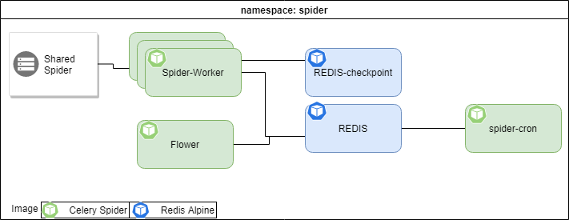

> Most of the work blongs to [cronosnull](https://github.com/cronosnull)

# Celery HTCondor Spider

The celery version of the htcondor-spider is designed for horizontal scalability and maintainability. The [celery spider docker image](https://hub.docker.com/repository/docker/mrceyhun/cms_htcondor_es) is based on this repository.  The image has a size around 420MB.

## Components

### spider cronjob

Queries the collectors for the schedd names and triggers the execution of the spider. 

### Redis and Redis-checkpoint

Redis is used as the celery message queue and results store. We also use another Redis instance, `redis-checkpoint`, to store the last execution time of the history query on each schedd. 

### Spider worker

The celery workers that will execute the tasks. 

### Flower

Celery monitoring interface. It allow us to see the amount of queue messages. 

### Shared spider volume

Persistent shared storage, it is used to store the affiliation directory cache. 

# Secrets

- collectors: A json file with the list of collector for each pool
- AMQ credentials
  - amq-password
  - amq-username
- ElasticSearch credentials: es-conf

# Environment Variables

Additional to the environment variables defining the location of the secrets, this environment variables need to be set according to the execution environment.

- CMS_HTCONDOR_BROKER
- CMS_HTCONDOR_PRODUCER
- CMS_HTCONDOR_TOPIC
